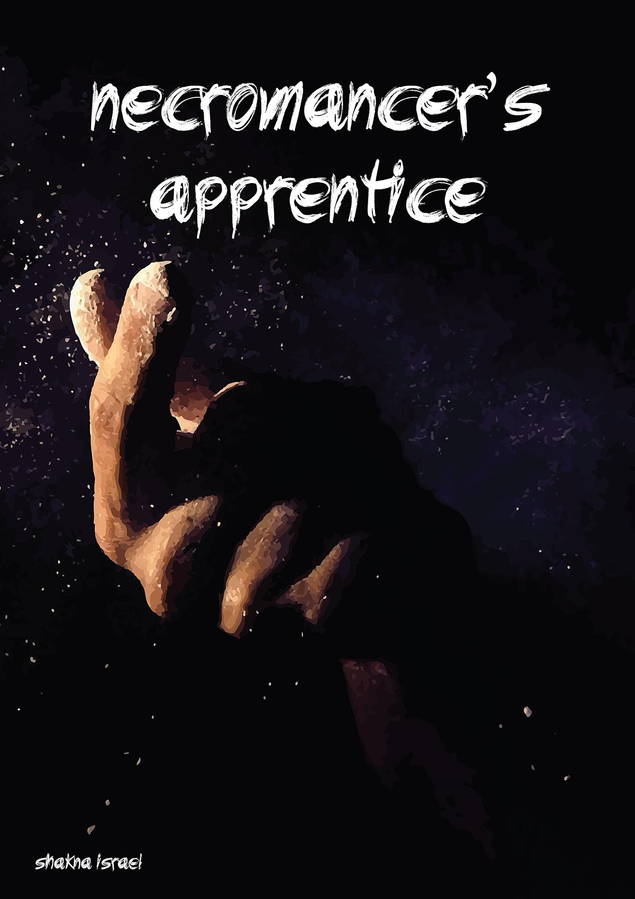

## This is Open-ish Source
I don't think anyone would call the CC license (viewable in the LICENSE file) fully open source, and I am definently among them.

## This is a fictional book.
Open Source books have always fascinated me, and I have always loved the idea.

Also, I love using Markdown for writing, it makes things easier.

So, in the spirit of this friendship, I'm going to release, as I write it, the latest novel I've been working on, [**Necromancer's Apprentice**](http://www.shaknaisrael.com/necromancers-apprentice/) under this license, and see what we can do with it.

As far as open source books go - I haven't seen a fictional one, yet.

## Blurb
The world was born in fire.

It was destroyed by ice.

It was rebuilt by blood.

## Contributing
There's a few ways to help out with this project.

Firstly, if you spot a grammar or spelling issue - [create a pull request](https://help.github.com/articles/creating-a-pull-request/)

Secondly, if you want to add to the story in someway, write some part in any part of any chapter - [create a pull request](https://help.github.com/articles/creating-a-pull-request/)

Thirdly, if you don't like the way the story is going, or want to take it in any direction - [fork it](https://help.github.com/articles/fork-a-repo/). *If you make a fork, let me know and I'll add it to the README for others to find*.

