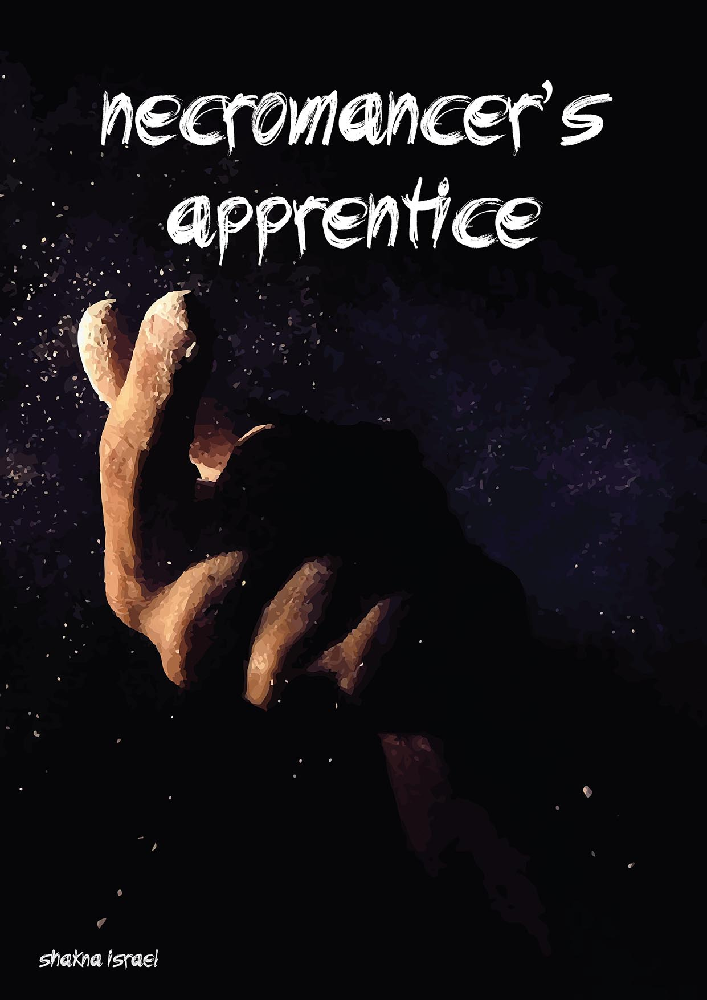

## Read

[PDF](#TODO), [ePub](#TODO), or [Read Online](#TODO)

## Blurb
The world was born in fire.

It was destroyed by ice.

It was rebuilt by blood.

## Copyleft
----

Released under the [Creative Commons Attribution-ShareAlike 4.0 International Public License](https://creativecommons.org/licenses/by-sa/4.0/legalcode).

You are free to:

Share - copy and redistribute the material in any medium or format

Adapt - remix, transform, and build upon the material for any purpose, even commercially.

The licensor cannot revoke these freedoms as long as you follow the license terms.

*This is not a substitute for the [License](https://creativecommons.org/licenses/by-sa/4.0/legalcode).*

## Contribute
----

You can find the latest version of this book, over on [Github](https://github.com/shakna-israel/NecromancersApprentice).

From there, you can help make changes, grab your own copy, and make and publish your own version of the book, if you want.

That's the beauty of Open Source.
